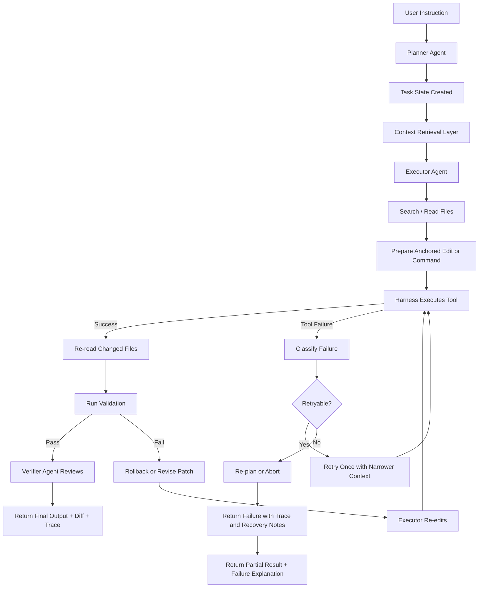

# PRESEARCH

## Summary

The pre-search conclusion for Shipyard is that the strongest coding-agent architecture is not a single monolithic prompt loop. It is a harness-driven system with planner, executor, and verifier roles operating over structured tools inside a controlled workspace. The agent should inject only the context needed for the current step, edit through anchor-based replacements with precise localization, classify tool failures as runtime events, validate every meaningful change, and log the full execution path so runs are explainable after the fact.

## Reference Systems Studied

### Codex CLI / Codex-style harness

What we studied:

- local coding-agent loop behavior
- sandboxing and approval boundaries
- persisted thread, turn, and item context
- structured editing flows such as `apply_patch`

What we took from it:

- the runtime should operate in a controlled workspace
- edits should happen through structured mechanisms rather than freeform rewrites
- tool calls, file edits, and outputs should be auditable

### SWE-agent

What we studied:

- explicit tool-based repo navigation
- issue-to-fix workflow structure
- editing and retry patterns

What we took from it:

- the model should act through explicit tools for search, read, and edit
- repo navigation and validation should stay tightly coupled to the edit loop

### OpenHands

What we studied:

- typed tool and LLM failure handling
- orchestration and SDK patterns
- dynamic tool integration

What we took from it:

- failures should be typed and surfaced explicitly
- the runtime should normalize and classify failures instead of treating them as vague agent mistakes

### Cursor-style workflows

What we studied:

- project rules and codebase context
- developer-facing context ergonomics
- hooks and environment setup

What we took from it:

- context should be layered and scoped
- project rules and codebase context are part of runtime quality, not optional extras

## Key Design Conclusions

### Architecture

Adopt a harness-first runtime with a sequential `planner -> executor -> verifier` role model, persistent task state, structured tool schemas, validation gates, rollback safety, and trace logging.

### File Editing

Chosen strategy: `anchor-based replacement -> verify -> rollback`.

The runtime does not treat whole-file rewrites as the default edit path. It localizes an anchored block, replaces only that block, validates the result, and rolls back on validation failure.

1. Search for the symbol, file, or error.
2. Read the narrowest useful file region.
3. Identify stable anchor text around the target block.
4. Replace only the anchored block, not the whole file.
5. Re-read the changed region.
6. Run the narrowest useful validation.
7. Re-localize and retry once if the anchor selection is wrong.
8. Roll back automatically when validation fails and recovery is possible.

### Context Management

Manage context through layered injection rather than replaying the entire repo or transcript:

- instruction layer
- task objective and constraints
- retrieved repository context
- recent tool results and failures
- rolling summary of prior steps

### Failure Handling

Treat failed tool calls as typed runtime events with explicit categories such as validation failure, permission error, timeout, not found, invalid arguments, empty output, or retryable infrastructure failure.

### Persistent Loop

Keep the loop alive in the runtime service, not in the model. The runtime owns progression, retries, checkpoints, validation, and finalization. The model is stateless between calls except for the context injected by the runtime.

### Cost Discipline

Use step-scoped token budgets, bounded excerpts, summary compression, narrow validation first, and hard retry caps. The main cost cliffs are large file dumps, transcript replay, repeated failed retries, and unstructured multi-agent chatter.

## System Diagram

## Context Injection Spec

| Context Type | Format | Injected When |
|---|---|---|
| System instructions | Structured runtime contract | At loop start |
| Project rules | Markdown or rendered text | At loop start and when role context is assembled |
| Current task objective | Structured task section | At loop start and before major role transitions |
| Relevant files and excerpts | Bounded file snippets | Before planning, editing, and verification |
| Recent tool results | Structured JSON or summarized text | After tool calls and before the next decision |
| Active plan state | Structured step state | Before executor and verifier calls |
| Validation targets | Structured list | Before edit and before final decision |
| Known failures | Structured list | After retries, rollbacks, or verifier rejection |
| Rolling summary | Short text summary | After each loop and before follow-up steps |

## Tooling Needed

| Tool | Purpose |
|---|---|
| Repo search | Finds files, symbols, strings, and references |
| File read / range read | Pulls narrow code context for localization and verification |
| Anchor-based surgical edit tool | Applies minimal create, update, or delete changes using stable anchors |
| Shell command runner | Runs bounded validation commands inside the workspace |
| Validation normalizer | Converts test, lint, and typecheck results into structured success or failure |
| Diff tool | Shows before and after changes for verification |
| Checkpoint / rollback | Restores original content when validation fails |
| Trace logger | Captures prompts, tool calls, outputs, edits, retries, timing, and cost |
| Context summarizer | Compresses recent steps into durable working memory |

## Failure and Recovery Policy

- Require localization evidence before patching.
- Re-read the file after every meaningful edit.
- Validate after every meaningful change.
- Retry localization once when the patch target is wrong.
- Roll back automatically when validation fails and recovery is possible.
- Re-plan rather than continuing to stack speculative edits on top of a failing state.

## Observability Evidence

Public LangSmith traces:

- [Trace 1](https://smith.langchain.com/public/a91c292c-fff8-41cb-ac5f-782a5c029f82/r)
- [Trace 2](https://smith.langchain.com/public/eafcc329-cb7e-4ece-bb56-a92491bdb355/r)

Submission screenshot evidence:

- The provided LangSmith screenshot shows the `shipyard-runtime-observability` project with completed runs on March 24, 2026.

## Architecture Artifacts

The repo architecture artifacts produced from this research and implementation are:

- [`README.md`](./README.md)
- [`docs/architecture/system-architecture.md`](./docs/architecture/system-architecture.md)
- [`docs/architecture/implementation-phases.md`](./docs/architecture/implementation-phases.md)
- [`docs/architecture/editing-strategy.md`](./docs/architecture/editing-strategy.md)
- [`docs/architecture/observability.md`](./docs/architecture/observability.md)
- [`docs/architecture/model-strategy.md`](./docs/architecture/model-strategy.md)
- [`docs/architecture/infrastructure.md`](./docs/architecture/infrastructure.md)
- [`instructions/decisions/adr-001-stack.md`](./instructions/decisions/adr-001-stack.md)
- [`instructions/decisions/adr-002-runtime.md`](./instructions/decisions/adr-002-runtime.md)
- [`instructions/decisions/adr-003-edit-strategy.md`](./instructions/decisions/adr-003-edit-strategy.md)
- [`skill.md`](./skill.md)
- [`task-prompt-template.md`](./task-prompt-template.md)

## Sources

- [OpenAI Codex CLI docs](https://developers.openai.com/codex/cli/)
- [OpenAI apply_patch guide](https://developers.openai.com/api/docs/guides/tools-apply-patch/)
- [OpenAI sandboxing docs](https://developers.openai.com/codex/concepts/sandboxing/)
- [SWE-agent paper](https://arxiv.org/pdf/2405.15793)
- [OpenHands error handling docs](https://docs.openhands.dev/sdk/guides/llm-error-handling)
- [Cursor context docs](https://cursor.com/learn/context)
- [Cursor hooks docs](https://cursor.com/docs/hooks)
- [Codex app-server reference](https://github.com/openai/codex/blob/main/codex-rs/app-server/README.md)
